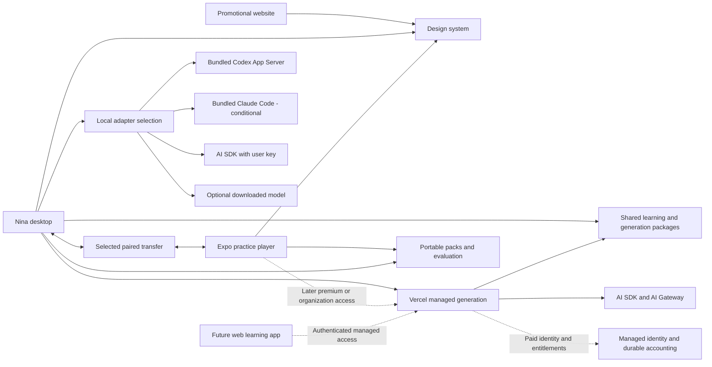

# Product roadmap

GitHub Issues and the Call Nina Project own approval, priority and execution status. This document records product direction; its proposed sequence does not independently authorize work.

Updated: 2026-09-27. Status: consolidated product decisions and proposed development sequence, grounded in repository inspection and documentation research. The tier and hybrid-execution direction, Clerk identity, desktop-first learning loop, reusable personal materials and personal-use/commercial licensing direction below are agreed. Remaining service selections, prices, limits, runtime packaging and legal terms require investigation. No runtime prototypes or local-model quality evaluations have been completed as part of this plan.

## Direction and first milestone

Build a local-first, goal-driven language-learning product that nontechnical people can install and use. The in-app home experience is “Call Nina”: explain what you want to do and Nina guides you into a specific exercise. Desktop creates/manages learning material through a shared generation interface: bundled official subscription runtimes, direct BYOK access, optional downloaded local models, or Nina-managed generation on Vercel. Android and iOS use React Native with Expo to consume prepared material and practise offline. A separate website starts as a promotional landing page. A future authenticated web learning app can reuse managed generation, but is not part of the first release.

Keep the initial product free of an app-hosted cloud database. Prefer local transfer; a simpler, low-cost Vercel-assisted transfer is an option to investigate, not a requirement to introduce cloud sync. Keep content/progress local and transport-independent so hosting can evolve later without redesigning exercises.

Confirmed priorities:

- Individual learners and the desktop learning loop first; teachers and companies follow. Mobile and additional provider integrations must not be prerequisites for proving that practice improves subsequent recommendations.
- Android and iOS participate from the first mobile pilot, using React Native **with Expo**.
- Replace the current UI with a new, more visual design system in an independent workspace package, starting from the supplied Call Nina design reference.
- Add supported languages deliberately, with separate user/interface and learning-language choices.
- Move learning logic behind a provider-neutral interface while retaining Codex App Server as a supported adapter. Investigate bundling standalone Codex first, then unmodified Claude Code under its applicable conditions. Pi is no longer the committed replacement. Users install Nina once; no separate Codex desktop app, Claude Code, Node, plugin or development-tool installation should be required.
- Support free personal use with a small Nina-funded online allowance, optional free desktop offline AI, BYOK and eligible provider subscriptions. Premium personal and enterprise offerings fund managed models; enterprise is the main commercial focus. BYOK and subscription/local-model access are funding routes, not separate paid Nina tiers.
- Nina starts with typed requests and suggested prompts; add voice later. Onboarding asks a few questions, detects supported existing AI access where possible, and offers a rate-limited starter AI route through Vercel for users without suitable access.
- Immediate personal use requires no app login: open the installed app and start with the free API route, subject to service availability and server limits. Connecting an existing provider subscription or API key is optional. Future premium and enterprise offerings **will require app login**; the no-login decision applies to the free personal experience, not every future tier. Starter-service server limits and operating budget will be decided later, before enabling public access.
- Optimize first use, AI connection and phone pairing for nontechnical users. Advanced provider/model settings must not dominate the normal journey.
- Minimize infrastructure, operating cost and maintenance. No cloud learner database is required for initial learning, request-based generation, pairing or transfer. Paid identity, billing, quota accounting and organizations later require durable state with explicitly chosen owners.

The first learning checkpoint is desktop-only, using the current supported AI path and prepared activities while packaging and alternative adapters are investigated:

> A learner chooses a goal or saves a pasted passage, practises, receives feedback, and retains the attempt locally. On returning, Nina suggests relevant review or fresh practice with a reason grounded in that history. A recorded difficulty changes what is suggested; later independent success changes review priority or timing. The learner can choose something else and reuse the saved passage without pasting it again.

The later desktop-to-phone milestone extends that useful desktop experience:

> A learner installs and opens one desktop app, starts with free API access without registering or connecting a provider, answers brief learning questions, types “I want to practise ordering coffee” to Nina, opens the suggested exercise, sends a short pack to an Android or iOS phone, practises offline, and returns progress without duplicate results.

The onboarding choices are confirmed; exact supported providers and the starter allowance still need verification and a cost ceiling. A technical API-key route may unblock a prototype, but does not by itself satisfy the nontechnical release gate.

Keep the full redesign, complete language catalog, paid billing, and enterprise features out of this first milestone. Plan the small starter AI route alongside onboarding, ahead of the full managed subscription platform; its server limits remain a later implementation decision. Existing-access prototypes and local practice can proceed before it is enabled. Introduce necessary data boundaries early, then expand a working product. Keep desktop-only use valuable throughout.

### Personal learning loop and user materials

Preserve and connect the existing mistake-based suggestions, vocabulary review and course-evidence logic. This is an incremental learning capability, not a requirement for a new recommendation model or vector database. Use the learner's goal, selected material, attempts, assistance and progress to choose relevant work. Keep supported answers and self-assessment distinct from independent evidence. Explain recommendations briefly, keep guided courses optional, and preserve direct access to practice and the library. Generalize the loop to additional languages after proving it in German.

User materials initially means learner-entered topics and pasted text. Existing reading practice already accepts a pasted passage; the new work is saving a reusable local material item and linking its revision to generated exercises and attempts. Include a title, language and optional source reference. Editing a material must not change the source associated with an older attempt. Let learners select and reuse material without entering it again; send only selected material and necessary context through the chosen AI route. PDF/OCR, website ingestion, audio imports and general document search are separate deferred features.

Reviewing, correcting or dismissing inferred learner information is **lower priority**, after the desktop loop. It means controlling retained statements such as a recurring difficulty, not exposing model reasoning. Keep existing profile settings and cleanup controls; do not make a comprehensive AI-memory editor a first-release prerequisite. Broader personal export and retention controls remain separate lower-priority follow-ups, not implicitly included in this learning-loop change.

## Call Nina experience and design starting point

The source is **Call Nina Design System.pdf**, supplied on 2026-09-27 and reviewed across all five pages. It is a provisional visual reference, not a final feature specification or an instruction to adopt every implementation detail in the PDF. Its Spanish examples do not select a launch language; phone/microphone icons do not settle live voice scope; streak/XP samples do not commit the product to gamification.

| Foundation from the reference                                      | Initial application                                                                                                                                                                                                 |
| ------------------------------------------------------------------ | ------------------------------------------------------------------------------------------------------------------------------------------------------------------------------------------------------------------- |
| Wheat brand, Ink text, Sand surfaces                               | Start with brand `#DB7A2C`, strong ink `#1B2238`, app background `#FFFCF7`, white cards and semantic aliases. Verify contrast for each actual state rather than assuming every palette combination is accessible.   |
| Fredoka headings, Figtree body, JetBrains Mono pronunciation hints | Bundle licensed font assets for offline use; check language/script coverage and scalable text on web/native. Use mono only where pronunciation benefits.                                                            |
| Rounded, tactile controls                                          | Start from 14px controls, 20px cards, 28px dialogs, pill chips, and a 4px spacing base with a 2px half-step. Adapt touch targets and density per platform.                                                          |
| Nina ridgeback mascot and phone motif                              | Use as the initial friendly identity for onboarding/home and illustration. Obtain editable assets and settle the final product name before renaming app identifiers.                                                |
| Warm, brief copy; Nina uses “I”                                    | Ask practical questions, explain the next step plainly, and avoid runtime/provider jargon in ordinary screens. Make clear that Nina is an AI guide.                                                                 |
| Semantic colors, Lucide icons, motion                              | Pair meaning with text/icon cues; bundle icons instead of following the PDF's CDN example. Treat motion timings as references and respect reduced motion. Start light-only; the reference remains open to revision. |

**Desktop home flow:** show a friendly Nina prompt, optional example requests and a visible route to the library. Interpret the learner's goal, language, available time and existing material; ask one brief clarification only when needed. Return a concrete activity card with a reason, estimated duration and a “Start” action. Prefer suitable existing material; offer bounded desktop generation when no suitable activity exists.

Nina returns a validated app action such as `open-activity`, `prepare-exercise`, or `clarify`, with known identifiers and bounded parameters. The application checks existence, language, capability and current state before executing it. Model output must not become arbitrary navigation, code, database edits or shell commands. Keep Cancel/Back and direct exercise access available; preserve the request on failure. Do not turn a simple request into an extended chat or a mandatory form.

**Mobile home:** keep the same friendly identity, but route into downloaded packs with local filters and prepared suggestions. The first mobile release has no generation or subscription runtime; requests needing new material direct the learner to desktop. Later premium/enterprise mobile generation calls the managed Vercel service without requiring the desktop to be online. On-device phone models and desktop remote-control bridges are deferred. Free practice of prepared packs remains available.

**Confirmed: text first, voice later.** Typing and suggestion chips are the initial Nina interaction, with text replies and activity cards. Speech input, spoken replies, and a continuous voice conversation are separate future capabilities with different cost and platform requirements. The design's call/microphone imagery does not add them to the first release. Existing Codex-dependent voice features remain route-specific until their disposition and cross-provider scope are explicitly decided.

**Promotional website:** explain the product, demonstrate Nina's in-app flow, and offer supported downloads. It has no public live AI chat or learner account requirement in the first version, avoiding an extra inference service and its costs.

## Simple transfer now, scalable transport later

The initial data source of truth is each device's local storage, with desktop owning authored material. Pack and attempt contracts stay independent of transport. The user delegates the choice to whichever is simplest to start: select one route after E4 based on implementation effort, nontechnical setup, reliability, maintenance and total cost. LAN is the first candidate to prove, not a fixed requirement. Do not implement every option in parallel.

| Option                                         | User experience                                                                                                                                               | Infrastructure/cost                                                                                                        | Recommendation                                                                                                |
| ---------------------------------------------- | ------------------------------------------------------------------------------------------------------------------------------------------------------------- | -------------------------------------------------------------------------------------------------------------------------- | ------------------------------------------------------------------------------------------------------------- |
| Direct local transfer with QR pairing          | Open both apps on the same Wi-Fi, scan once, confirm the device, then use “Send to phone”/“Sync progress.” Both devices need to be reachable during transfer. | No hosted data store or transfer service; app work for discovery, authentication, permissions and networking.              | Prove first. No IP addresses, terminal commands, router setup or certificate installation in the normal flow. |
| Export/import through the system share/file UI | Send a portable pack or progress file using an existing device-sharing channel.                                                                               | No app-hosted service; less seamless and platform-dependent.                                                               | Evaluate as a recovery path if it reduces support burden; not the default happy path.                         |
| Temporary encrypted Vercel Blob transfer       | Upload an encrypted pack, claim it on the phone through a QR/link, then remove the temporary object. Can avoid local-network reachability problems.           | Small API plus object storage, traffic, request and cleanup costs; no learner database, but still temporary cloud storage. | Select if the prototype shows it is simpler overall within the budget. No assumption that it is free.         |
| WebRTC with hosted signaling/relay             | Potentially direct internet transfer while both peers are online.                                                                                             | Signaling and potentially TURN relay operations/bandwidth, plus native integration and connection recovery.                | Defer unless E4 shows a clear advantage; “peer to peer” does not guarantee zero infrastructure.               |

Vercel Blob documents private storage and deletion APIs; it can support an encrypted handoff design, but this is a proposed application architecture, not a ready-made synchronization product. Compare measured transfer success and support effort against direct LAN. [Blob SDK](https://vercel.com/docs/vercel-blob/using-blob-sdk), [Blob pricing](https://vercel.com/docs/vercel-blob/usage-and-pricing). WebRTC requires a signaling mechanism and may need TURN relaying across networks. [WebRTC peer connections](https://webrtc.org/getting-started/peer-connections).

If temporary cloud transfer is selected, establish device trust separately from the storage service, encrypt on the sender, and keep decryption secrets out of URLs sent to the service/logs. Use scoped expiring transfer capabilities and private objects. Enforce size, bandwidth and issuance limits without shipping a shared service secret. An expiry on a link does not delete stored bytes: implement cleanup after acknowledgment and a time-based sweep for abandoned objects. Never advertise one-time access without an atomic mechanism that actually enforces it. Include retry/replay, outage, abuse and cleanup behavior in the prototype; unresolved cost control means retain LAN as the release path.

Cost planning should include the commercial hosting plan baseline, active users × transfers × average compressed pack size, downloads/retries, storage retention, API/cleanup operations and build/signing services. Agree a monthly ceiling and disable optional hosted transfer when its safe budget is exhausted; local practice remains available. Vercel currently describes Hobby as noncommercial personal use, so a commercial launch must not assume the free Hobby plan covers it. [Vercel Hobby plan](https://vercel.com/docs/plans/hobby).

No hosted Postgres, Redis, user/profile store or permanent cloud learning library is part of this first transfer design. Future managed billing/organizations require durable authorization/accounting somewhere; that is a later explicit architecture decision, not justification to add a database to the first mobile release or disguise one as a collection of Blob JSON records.

## Tiers, people and model access

These are the agreed product boundaries. Keep **Nina plan**, **organization role**, **generation route**, and **device capability** separate in code and UI. One person can be a personal learner and a teacher in an organization; a provider subscription does not create a premium Nina entitlement. “Enterprise” describes the school/company offering, not a particular upstream model name. No exact prices or allowances are selected yet.

### People and account requirements

| Person or context                  | Nina account                                                  | Access and responsibility                                                                                                                                                                                                                                               |
| ---------------------------------- | ------------------------------------------------------------- | ----------------------------------------------------------------------------------------------------------------------------------------------------------------------------------------------------------------------------------------------------------------------- |
| Free personal learner              | Not required                                                  | Ready-made activities, local library, small anonymous online starter allowance on desktop, personal transfer and offline practice. Optional BYOK, eligible provider subscription or downloaded desktop model. No Nina fee for these personal routes.                    |
| Premium personal learner           | Required                                                      | Paid, bounded Nina-managed generation; initially desktop, later direct mobile and potentially web generation. Personal local data remains private. Subscription quotas/pricing are still to be designed.                                                                |
| Organization owner/admin           | Required                                                      | Creates/manages the teaching, school or company workspace, membership, billing, budgets and policies. Administrative status does not imply permission to inspect all personal learning content.                                                                         |
| Independent teacher/content author | Required for teaching workspace features                      | Generates with organization-funded managed models, reviews material, assigns packs and sees only authorized student progress. A teacher's unrelated personal workspace can remain separate.                                                                             |
| Organization learner/student       | Required for organization access                              | Receives assigned material and returns authorized progress. Organization entitlement can fund mobile/cloud generation when the organization permits it; a seat alone does not grant every AI capability. No individual premium purchase is required for covered access. |
| Internal Nina operator/support     | Separate restricted operational identity, not a customer plan | Manages service health, budgets and support actions with least privilege; no routine access to learner content. Implement only the access needed for the actual service.                                                                                                |

An optional signed-in free state may be useful after a premium cancellation or for future account features, but signup must not become a prerequisite for free personal use. Preserve downloaded personal packs and attempts on upgrade, downgrade and logout. Define explicit linking of the local learner profile to an account; never silently merge a shared computer's profiles or upload an entire local library during registration. Organization content retention and post-removal access need their own policy.

### Generation and cost matrix

“Local workflow” means Nina's orchestration runs on the computer. Only the downloaded-model route also runs **model inference** there; API keys and subscriptions still send the selected context to external model providers.

| Route                      | Workflow location      | Inference location and integration                                    | Credential/billing owner                                                     | Nina login and client scope                                                                                            |
| -------------------------- | ---------------------- | --------------------------------------------------------------------- | ---------------------------------------------------------------------------- | ---------------------------------------------------------------------------------------------------------------------- |
| Free online starter        | Nina backend on Vercel | AI SDK → AI Gateway → selected low-cost or currently free model       | Nina keeps the service key and pays upstream within a hard shared budget     | No Nina login; desktop starter experience. No free mobile/web generation promised.                                     |
| Premium managed            | Nina backend on Vercel | AI SDK → AI Gateway → plan-allowed models                             | Nina pays upstream, funded by personal premium payments                      | Nina login required; desktop first, mobile generation later, web app optional later.                                   |
| Enterprise managed         | Nina backend on Vercel | AI SDK → AI Gateway → organization-allowed models                     | Nina pays upstream, funded by organization contract and bounded budgets      | Nina login and verified organization permission required; desktop and later mobile/web.                                |
| Bring your own API key     | Desktop                | AI SDK provider adapter → provider directly; no Nina gateway required | User owns key/account and pays provider directly                             | No Nina login required for personal use; desktop generation only initially.                                            |
| ChatGPT/Codex subscription | Desktop                | Bundled standalone Codex in App Server mode → OpenAI                  | User signs in through Codex's official flow; eligible subscription allowance | No Nina login required for personal use. No Codex desktop installation required.                                       |
| Claude subscription        | Desktop                | Bundled unmodified Claude Code → Anthropic                            | User authenticates through Anthropic's own flow and funds their usage        | Conditional on distribution/authentication requirements; desktop only. Not the Nina-funded enterprise execution route. |
| Downloaded local model     | Desktop                | Embedded local inference runtime, with an app-owned adapter           | User supplies compute/electricity; model downloaded to the computer          | Optional free personal route without Nina login; offline after download for supported activities.                      |

BYOK, subscription and downloaded-model routes incur no Nina model-inference bill when entirely direct. They can still incur Nina distribution/download, maintenance and support costs. Avoid claiming zero total operating cost. Premium and enterprise pay for managed service, convenience and organizational capabilities; they do not make local practice dependent on a subscription.

**Shared implementation, different adapters:** keep one portable source for goal/language context, exercise schemas, prompt construction, validation, quality rules and reusable generation steps. Desktop and Vercel import these packages; do not copy two versions of the same learning logic. Runtime adapters own authentication, capabilities, tool execution, progress, cancellation and provider errors. Official agents own parts of their internal loops, so identical orchestration cannot be assumed. All routes produce the same validated pack and provenance format. Separate storage/network adapters from pure domain logic; never import Electron, filesystem access or credentials into mobile/browser bundles.

The managed backend executes the workflow, including bounded model calls and repair, rather than merely forwarding unrestricted prompts. Free/premium/enterprise share the implementation but have distinct server-enforced policies. The desktop BYOK path can reuse the same portable steps with an AI SDK provider adapter. Local inference is another adapter, not a separate exercise format. Pi may be reconsidered only for a concrete missing capability; it is not necessary to implement the agreed routes.

### Subscription integration boundaries

- **Codex:** the current app already launches `codex app-server --listen stdio://` and communicates over JSON-RPC. Its current executable discovery prefers the ChatGPT/Codex desktop installation; that is an app choice, not an upstream prerequisite. The official standalone executable and App Server authentication support a bundled route. Prove a pinned release, required runtime resources and login on a clean machine, and comply with redistribution/license notices. This is **App Server, not Azure**. [Official standalone Codex](https://github.com/openai/codex), [App Server and authentication](https://developers.openai.com/codex/app-server).
- **Claude Code:** investigate offering the unmodified binary under Anthropic's Commercial Terms and preserving its built-in authentication options. Users complete Anthropic's own login and fund their own usage. The published bundling conditions prohibit paying for/reselling/intermediating end-user Claude Code usage unless separately agreed. Do not route Nina-funded requests through this binary; use the managed API service under applicable API terms. Verify the exact embedded learning workflow before advertising it. [Claude Code product and authentication conditions](https://code.claude.com/docs/en/legal-and-compliance).
- A free/personal label alone does not authorize a third-party subscription adapter. Do not replace official runtime flows with copied OAuth tokens, browser cookies, pooled accounts or limit-evasion fallbacks. Technical support in Pi or a community AI SDK adapter is not provider permission.
- Organization generation is Nina-managed by product policy. Do not implement that by disabling required authentication options inside a bundled Claude Code runtime. Keep the organization service and personal runtime routes separate and validate the UX against the applicable conditions.
- Sharing a completed exercise pack is distinct from allowing students to consume a teacher's credentials. Do not assert that all teacher use of personally generated output is forbidden. Organization publication/import needs reviewed content, provenance and rights; provider credentials never travel with the pack. Personal subscriptions are not an organization-wide inference pool.
- A browser may open a provider's login, but cannot thereby run the desktop agent or turn subscription access into general API credit. A future website-to-desktop bridge would need an online paired computer and secure connection management. A public server-hosted subscription service would need explicit provider confirmation and isolated runtime/credential operations. Neither is planned for launch.

### Optional free desktop offline AI

Keep the online starter and prepared activities as the immediate first-run experience. Add a clearly optional “Download offline AI” route after focused quality/hardware exploration; do not require a multi-gigabyte download before the first exercise. Bundle/manage the inference runtime so users do not need Ollama, Python, terminal commands or another app. Supporting an existing local endpoint may be an advanced option later.

Initial candidates, not selected production models:

| Candidate                               | Evidence                                                                                                                                                                                                                                                  | What remains to establish                                                                                                                                                        |
| --------------------------------------- | --------------------------------------------------------------------------------------------------------------------------------------------------------------------------------------------------------------------------------------------------------- | -------------------------------------------------------------------------------------------------------------------------------------------------------------------------------- |
| Qwen3.5-4B, compressed four-bit variant | Multilingual model with Apache-2.0 model-card license; a Q4_K_M GGUF distribution is about 2.74 GB for the model file. [Model card](https://huggingface.co/Qwen/Qwen3.5-4B), [quantized files](https://huggingface.co/unsloth/Qwen3.5-4B-GGUF/tree/main). | Actual total RAM/context overhead, CPU/GPU performance, artifact provenance and teaching quality in selected languages. Download size is not RAM usage.                          |
| Gemma 4 E2B/E4B                         | Google positions these open-weight variants for mobile devices/laptops. [Model guide](https://ai.google.dev/gemma/docs/get_started).                                                                                                                      | Runtime support, applicable distribution license, realistic download/RAM requirements and language/exercise quality. Effective parameter labels are not total memory guarantees. |
| Embedded llama.cpp runtime              | Supports local CPU/GPU execution and an OpenAI-compatible server interface. [Runtime documentation](https://github.com/ggml-org/llama.cpp).                                                                                                               | Platform packaging, supported model/version, process ownership, localhost access controls and lifecycle. No mandatory global installation.                                       |

Start with short, bounded exercises grounded in reviewed lesson data: vocabulary examples, short dialogues and variations of known material. Use deterministic transformations where possible, such as turning a reviewed sentence and known answer into a gap-fill exercise. Schema validity is not linguistic correctness. Review answer keys, ambiguity, explanations and target difficulty independently for each supported language; open-ended grading and exam-level claims need stronger evidence. Do not promise image generation, live speech, unrestricted agent tools or quality parity with hosted models from a small text model.

The download flow needs a hardware/storage check, a clear download size, explicit choice, progress/resume/cancel, verified artifacts, and model removal independent of learner data. Recommend a supported variant automatically; avoid exposing quantization jargon. Measure time to a usable pack and memory pressure on representative modest computers before choosing minimum requirements. Keep context/output small; slow CPU generation is acceptable only with useful progress and cancellation. Never silently send an offline request to the cloud. Model hosting/bandwidth and updates are part of the cost plan.

### Mobile and future web entitlements

The first Expo release remains a free player for prepared packs with local progress and personal transfer. It does not run subscription agents or downloaded LLMs. Later, direct mobile generation requires premium or organization-funded access and calls the same managed backend; this is a business/scope choice, not a claim that phones cannot run small models. A student can practise already downloaded personal material without buying premium. Organization pack access follows the organization's explicit policy.

The public website stays a promotional landing page. A future web learning application can offer authenticated managed generation without a desktop connection. Web BYOK, free web generation, phone-local inference, and remote control of desktop subscription agents are separate deferred decisions. Do not silently expand the landing page into an anonymous public inference surface.

## Public source and licensing direction

**Decision (2026-09-27): pursue publicly inspectable source under a custom free personal-use license plus paid commercial terms.** This adopts the licensing model discussed after reviewing the mission proposal, not the proposal's preferred PolyForm Shield license or every aspiration in that document. The future restricted model should be called **source available**, not open source. No license text is adopted by this roadmap: the repository's `LICENSE`, package metadata and `docs/licensing.md` remain MIT until an explicit, reviewed licensing change.

The intended business boundary for legal drafting is: individuals may use Nina free for their own learning, including learning for work or career development; using Nina to deliver paid teaching services or deploy learning services for an organization requires a commercial license. Resolve unpaid teaching, nonprofit/public-school use, redistribution and forks, and sharing generated exercise packs explicitly in the final terms. A learner's personal library and saved work should not become dependent on a commercial account or subscription. App licensing, hosted inference charges and upstream provider eligibility remain separate concerns; buying a Nina license does not grant third-party model access.

PolyForm Shield restricts competing offerings rather than ordinary internal commercial use. PolyForm Noncommercial expressly permits educational institutions regardless of funding, so neither exactly implements the intended boundary. Commercial restrictions are incompatible with the Open Source Definition. [Shield terms](https://polyformproject.org/licenses/shield/1.0.0), [Noncommercial terms](https://polyformproject.org/licenses/noncommercial/1.0.0), [Open Source Definition](https://opensource.org/osd).

Before changing the license or publishing restricted-use claims, have the terms drafted/reviewed, establish rights to contributions and the status of previously distributed MIT versions, and define the scope for code, original curriculum, branding, dependencies, bundled runtimes and model weights. Do not assume new terms withdraw earlier MIT grants. Confirm where source will be publicly inspectable alongside official installable releases. These are later licensing/release decisions, not new account checks or enforcement work for the current refactor.

## Nina registration, authentication and entitlements

**Decision (2026-09-27): Clerk is Nina's selected application identity provider; Vercel hosts the application/backend.** Registration can start on a Nina page hosted on Vercel, while Clerk handles account creation, authentication and sessions. Vercel deployment protection secures developer deployments, not customer membership. “Sign in with Vercel” authenticates people using a Vercel account; it is not the desired default for nontechnical learners. [Application authentication on Vercel](https://vercel.com/kb/guide/application-authentication-on-vercel), [Sign in with Vercel](https://vercel.com/docs/sign-in-with-vercel).

Clerk is selected for individual paid accounts, independent teacher workspaces, students and future schools/companies. This is a product decision, not a Vercel requirement. E6b now resolves integration and plan configuration rather than comparing identity vendors. Prove packaged Electron login, Expo sessions, logout/revocation and account switching; verify export/deletion, regional requirements and organization costs before launch. No Clerk tenant, subscription or application integration is created by this planning change. [Clerk Organizations](https://clerk.com/docs/guides/organizations/overview), [Clerk Expo authentication](https://clerk.com/docs/expo/getting-started/quickstart).

Vercel also now offers **Passport**, which gates deployments using an existing identity provider. It can participate in company access: supported identity-provider group claims can be forwarded and mapped by Nina to admin/teacher/student permissions. It does not itself supply a managed customer-organization system with invitations, role administration, classes or tenant isolation. Evaluate it for internal administration or a specific enterprise deployment with an existing identity provider; verify multi-company and native-client requirements before adopting it more broadly. Current documentation lists it as a Vercel Enterprise feature with sales pricing. Keep customer lifecycle and Nina authorization explicitly owned even if Passport supplies authentication. [Passport scope and availability](https://vercel.com/docs/passport), [group claims](https://vercel.com/docs/passport/additional-identity-scopes).

Keep four distinct authorities:

| Concern                                  | Proposed owner                                         | Boundary                                                                                               |
| ---------------------------------------- | ------------------------------------------------------ | ------------------------------------------------------------------------------------------------------ |
| Who the Nina user is                     | Clerk                                                  | Stable user ID and verifiable sessions; email alone is not a tenant/permission identifier.             |
| What they purchased                      | Billing provider plus verified entitlement projection  | Paid status, renewal/cancellation and subscription mapping; a successful login does not prove payment. |
| What they may do in a workspace          | Clerk memberships/roles plus Nina domain authorization | Organization selection, content access, generation permissions and budgets checked on the server.      |
| How a personal model route authenticates | Official runtime or user's secure local key store      | Independent of Nina login; credentials stay local and are not repurposed as Nina identity.             |

Suggested registration path when premium/enterprise ships: select paid access or accept an organization invitation → open hosted Nina sign-in in the system browser → return via a validated platform-supported callback → establish a session → backend checks the relevant entitlement. Use standard native OAuth/OIDC with PKCE where supported and appropriate, safe web sessions, OS-secure token storage and logout/revocation. Do not invent password handling or embed a confidential OAuth client secret in a shipped app. Resolve concrete redirect/deep-link behavior in E6b.

Model identity separately from access: local learner/profile ID, optional Nina user ID, personal plan/entitlement, organization memberships with roles, selected workspace, and selected generation route/capabilities. A person can belong to more than one organization later; design identifiers so this is possible without implementing multi-organization UI initially. The server must derive membership and quotas from trusted state, not client-submitted plan or organization labels. Personal paid access must not grant organization administration, and leaving an organization must not delete unrelated personal data.

Keep anonymous personal use account-free. Premium and all organization features require Nina login. At upgrade, offer explicit local-profile linkage without automatic cloud-library upload. At cancellation, stop future paid generation according to the billing policy while preserving personal offline practice. Define account switching on shared devices and deletion/export independently of ordinary logout.

**Storage constraint by stage:** the personal MVP needs no app-hosted learner database. Managed identity/billing vendors do store durable account/payment data; that must be acknowledged, not described as “no cloud data.” Before charging users, E6b must choose where verified entitlements, quota reservations, usage reconciliation and webhook deduplication persist. Use provider-managed capabilities if sufficient; otherwise explicitly select minimal durable service storage at that phase. No self-hosted database operations are desired. Organization memberships, assignments and reports later also need durable service state. Do not use function memory or ad-hoc Blob records as an accounting database. Account registration does not imply cloud learning-library sync.

### Clerk account and teaching-workspace plan

Use one Nina identity across clients, with separate Clerk development and production instances. Account-free personal users need no Clerk registration. Paid personal users have a Clerk user without needing an organization. An independent teacher registers, creates a teaching workspace represented by a Clerk Organization, then invites students; a company or school uses the same workspace concept. Classes are Nina records within a workspace, not a separate Clerk Organization per class. A teacher can also keep an unrelated personal learning profile. Clerk supports multiple memberships and organization context in sessions. [Organization model](https://clerk.com/docs/guides/organizations/overview).

The intended workspace roles are owner/admin, teacher and student. Clerk owns membership and organization-level roles; Nina owns class assignments, permitted student-result visibility, content ownership and usage budgets. Keep roles independent of payment plans. Verify session and workspace permission on the API for each protected operation; derive the active workspace from verified context and check access to each requested resource. Review default member permissions before exposing student accounts. Do not maintain a second independently editable membership list: any database copy is a reconciled projection of Clerk state. [Roles and permissions](https://clerk.com/docs/guides/organizations/control-access/roles-and-permissions).

Use Clerk's supported hosted or custom authentication flows. Expo has an official SDK, browser-hosted authentication, native components and custom React Native flows; choose the least work consistent with Nina's own design system, with secure token storage. Enabling Clerk's Native API changes browser CAPTCHA protection, so include native abuse controls in the integration investigation. Packaged Electron browser login and callback/session handling still require a focused proof; React/web support alone is not evidence that the desktop flow works. Clerk secret keys stay in server integrations. [Expo options and Native API](https://clerk.com/docs/expo/getting-started/quickstart).

Research snapshot, 2026-09-27: Clerk's included tier currently allows 50,000 monthly retained users and 100 monthly retained organizations, with up to 20 members per organization and Admin/Member roles. **Production custom roles require the B2B Authentication add-on**, currently $100/month or $85/month billed annually; it also removes the per-organization member cap. These limits can matter before a school reaches high usage. Pro authentication is currently $25/month or $20/month billed annually; enterprise connections and organization linkage have their own plan/add-on conditions. Recheck current pricing before choosing allowances or teacher pricing. Anonymous personal learners do not need accounts merely to use the free app. [Clerk pricing](https://clerk.com/pricing).

Start teacher onboarding with ordinary account registration and invitations; a teacher does not need their own corporate identity provider. Later, enable Clerk enterprise SAML/OIDC connections for organizations that need company sign-in. Passport is not part of the standard Nina account architecture. [Organization enrollment and enterprise connections](https://clerk.com/docs/guides/organizations/overview).

Selecting Clerk for identity does not select Clerk Billing. E6b still chooses payment integration and durable usage accounting, including mobile purchase requirements. Before shipping teaching workspaces, record the Clerk plan needed for the real cohort size and role model, verify invitation/removal and role changes, and preserve unrelated personal/offline data when a user leaves a workspace.

## Guided AI onboarding and the limited starter service

The initial free personal experience has no app signup/login flow. Open directly into prepared activities and a small Nina-funded online allowance; store onboarding answers locally. Exact limits and operating budget are deliberately deferred until service implementation, before public enablement. Nina accepts some bounded upstream cost for this experience; do not make launch depend on a model remaining zero-priced.

Ask target/explanation language, goal and available time in short steps. Offer the default free online route, eligible existing subscriptions, advanced BYOK, and later the optional offline download on suitable hardware. Show which service receives the request and allow explicit switching. Detect supported existing installation/connection state only as a hint: an installed ChatGPT app neither proves entitlement nor authorizes credential reuse. Bundled standalone Codex means that installation is not required. Never scrape cookies or private credential stores, or collect a general software inventory.

The starter backend runs the generation workflow on Vercel using AI SDK and Gateway. It accepts validated Nina operations and minimal necessary learning context, chooses allowed models, enforces input/output/work limits, validates/repairs results and returns a pack for local storage. It is not an unrestricted prompt/model proxy. Keep service credentials on the server. Initial mobile practice does not call it; later paid mobile requests use authenticated managed endpoints.

“Free to the learner,” “currently zero-priced model,” and “Gateway free credits” are different. Gateway credits are an account/team allowance, not a grant for each Nina user. Validate model quality and availability; any paid fallback must remain inside an explicit budget and model policy. Never silently enable unlimited top-ups. [Gateway pricing](https://vercel.com/docs/ai-gateway/pricing), [model catalog](https://vercel.com/ai-gateway/models?type=text).

Slower free generation is acceptable, but deliberate delay alone does not lower token charges. Control cost with suitable cheaper models, short contexts, smaller packs, output caps, bounded repairs, reusable reviewed content and request/concurrency limits. Do not promise an exact latency or free allowance until observed. Do not share cached personalized learner content between users. Long jobs, durable queues and background completion are deferred; keep initial request-based work within Vercel execution limits. [Functions limits](https://vercel.com/docs/functions/limitations).

Before public access, verify request throttling, model/token limits, a bounded upstream key budget and a global availability switch, including concurrent in-flight overshoot and upstream failures. A currency budget alone does not bound calls to a zero-priced model. Managed edge controls can avoid an app-hosted database, but confirm cost and enforcement. [WAF rate limits](https://vercel.com/docs/vercel-firewall/vercel-waf/rate-limiting), [Gateway budgets](https://vercel.com/changelog/budgets-for-api-keys-on-ai-gateway).

IP limits can affect shared networks and can be evaded; device IDs and anonymous tokens are not verified people. Advertise a limited shared starter service rather than guaranteed per-person daily credits. No registration requirement is added to solve anonymous abuse. If affordable controls are insufficient, restrict availability and preserve prepared/offline/BYOK/subscription options. Use clear cooldown/exhaustion messages; do not switch funding source or upload offline content without user choice.

Initially send only the context needed for a generation request, return validated results, and persist packs locally. This supports cloud execution without a hosted learning library. Define transient processing, vendor retention and diagnostics; no learner prompts, output, credentials or private paths in routine logs. Later cross-device libraries and classroom distribution require their own data lifecycle and storage decision.

## Vercel architecture assessment — researched 2026-09-27

Use Vercel for the promotional website and Nina-managed API, with services added when their phase needs them. Keep local generation adapters, SQLite and the independent design system. The user accepts managed cloud storage for enterprise; the earlier no-cloud-database constraint still applies to the initial personal release. These are architecture recommendations, not provisioned services or verified Nina integrations. Recheck service maturity, pricing and SDK compatibility when implementing.

### Recommended services and adoption points

| Capability                           | Fit for Nina                                                                                           | Recommendation and boundary                                                                                                                                                                                                                                                                                                                               |
| ------------------------------------ | ------------------------------------------------------------------------------------------------------ | --------------------------------------------------------------------------------------------------------------------------------------------------------------------------------------------------------------------------------------------------------------------------------------------------------------------------------------------------------- |
| AI SDK Core and UI hooks             | Shared structured generation, tool calls and streamed conversation state                               | Adopt for direct-key and managed adapters. Render results with Nina components. The hooks handle interaction state without prescribing a visual design. [AI SDK UI](https://ai-sdk.dev/docs/ai-sdk-ui/overview).                                                                                                                                          |
| AI Gateway                           | Managed models for free, premium and organization routes; routing, usage visibility and spend controls | Adopt with the starter API. Explicitly allow models/providers and bound fallbacks. Gateway is not a consumer ChatGPT/Claude subscription bridge. [Gateway](https://vercel.com/docs/ai-gateway).                                                                                                                                                           |
| Functions with Fluid Compute         | Generation endpoints, later account/billing webhooks and authorized pack access                        | Use bounded request-based jobs first. Fluid shares compute across concurrent requests; execution limits still apply. Keep request data isolated and durable state outside process memory. [Fluid Compute](https://vercel.com/docs/fluid-compute).                                                                                                         |
| Managed Postgres through Marketplace | Paid entitlements/usage ledger; later organizations, assignments and progress reporting                | Evaluate **Neon first** alongside Clerk in E6b. It supplies managed Postgres with scale-to-zero and branching. No personal-MVP database. The old Vercel Postgres product is no longer available; new databases come from providers. [Postgres on Vercel](https://vercel.com/docs/postgres), [Neon integration](https://vercel.com/marketplace/neon/neon). |
| Private Vercel Blob                  | Exercise packs, images, audio and teacher uploads                                                      | Add for selected temporary handoff or later classroom distribution. Keep ownership/version metadata in Postgres once accounts exist. Authorize access before downloads; private storage alone does not define tenant permissions or end-to-end encryption. [Private Blob](https://vercel.com/docs/vercel-blob/private-storage).                           |
| Workflows                            | Multi-step pack generation, interrupted jobs, teacher review waits                                     | Add when work must survive a request, crash or deployment. Durable execution uses managed persistence and is therefore additional cloud state. Keep reusable learning steps independent of workflow orchestration; make model calls/retries and publication idempotent. [Workflows](https://vercel.com/docs/workflows).                                   |
| Queues and Cron Jobs                 | Independent batch distribution or scheduled cleanup/reconciliation                                     | Defer until a concrete background operation needs them. Queues is currently beta and delivers at least once; deduplicate effects. Workflows already uses queues internally, so do not add both automatically. [Queues](https://vercel.com/docs/queues), [Cron](https://vercel.com/docs/cron-jobs).                                                        |
| Firewall/WAF and BotID               | Protect the funded starter endpoint and later public web flows                                         | Establish server-side request limits before enabling free AI. BotID's browser integration may help web forms; do not assume it protects native Expo/Electron API callers. Verify supported native controls in E6a. [WAF rate limits](https://vercel.com/docs/vercel-firewall/vercel-waf/rate-limiting), [BotID](https://vercel.com/docs/botid).           |
| Flags or Global Config               | Disable funded generation, select an approved model, gradually release languages/features              | Start with the simplest server-owned configuration. Add managed rollout when needed; avoid two configuration products initially. Config/flags are not transactional quotas or authorization. [Flags](https://vercel.com/docs/flags), [Storage and Global Config](https://vercel.com/docs/storage).                                                        |
| Gateway observability                | Token costs, latency and model/provider failures                                                       | Use with redacted API diagnostics from the starter phase. Nina's educational progress and school reports require separate domain events and permissions. Do not record learner content in routine telemetry. [Gateway observability](https://vercel.com/docs/ai-gateway/observability-and-spend/observability).                                           |

### Own design system, including AI interactions

**Use AI SDK UI as the default integration; treat AI Elements as optional source material.** AI Elements is built on shadcn/ui and its installation assumptions include React 19 and Tailwind 4. Components are copied into the application and can be edited, so adopting an individual component does not require adopting Vercel's visual identity. Nevertheless, these are DOM/web components, not portable Expo native controls. Avoid introducing a second styling system solely to obtain chat bubbles. [AI Elements overview](https://elements.ai-sdk.dev/docs), [component ownership and customization](https://elements.ai-sdk.dev/docs/usage).

For Call Nina, prefer structured goal suggestions, activity previews, generation progress and exercise cards rendered through `packages/design-system`. A conversational hook can support the request flow without turning the whole application into a chat transcript. Share schemas, intent handling and tokens across platforms; E3 decides component reuse. The official Expo example uses AI SDK's React hooks with native controls and `expo/fetch` for streaming, which is a useful starting point for later paid mobile generation. Verify streaming, cancellation and background/resume behavior in the actual clients. [AI SDK with Expo](https://ai-sdk.dev/docs/getting-started/expo).

Streamdown is an optional streaming Markdown renderer for web/desktop explanations, not the exercise schema or native mobile design system. Chat SDK is a different product: it connects bots to external messaging platforms such as Slack and Teams. Defer it until a teacher/company pilot actually needs those channels. [Streamdown](https://streamdown.ai/), [Chat SDK](https://chat-sdk.dev/docs).

### Storage, accounting and enterprise controls

The paid-service architecture combines **selected Clerk identity** with **candidate managed Neon Postgres and private Blob**, connected to the planned Vercel API. E6b verifies Clerk integration and plan costs and selects the supporting storage services. Postgres would hold Nina user references, workspace permissions, entitlement projections, usage reservations/settlement, assignments and learning-event metadata; Blob would hold larger immutable pack/media objects. Keep local personal SQLite authoritative for unsynced personal data. Choose compatible service regions, pooled connections, backup/restore and deletion/export policies. Use sanitized data in preview environments. A hosted database enables shared state; it does not supply Nina's offline conflict handling or tenant authorization automatically.

**Gateway budgets do not implement Nina customer allowances.** They can target Vercel teams, projects, API keys and Vercel team members; “user” in that feature does not mean a Nina student. Separate free and paid service budgets and implement customer/workspace reservations in the paid ledger. Gateway BYOK spending does not count toward those budgets; Nina's personal BYOK route remains direct from desktop to the chosen provider. [Gateway budget scope and limitations](https://vercel.com/docs/ai-gateway/observability-and-spend/budgets).

For enterprise requests, evaluate Gateway provider restrictions and Zero Data Retention alongside contracts and region requirements. ZDR is available on Pro/Enterprise and must be configured; default routing does not filter exclusively to ZDR providers. It does not remove data retained by Nina's database, workflow state or other services. Do not promise blanket residency or privacy compliance from a Gateway setting. [Gateway ZDR](https://vercel.com/docs/ai-gateway/security-and-compliance/zdr).

### Costs and services to defer

Budget the full service path: hosting/compute, model tokens, auth, database compute/storage/backups, Blob storage/downloads and any workflow/queue/observability usage. Vercel Pro currently starts at $20/month with included usage credit; this is not the total Nina bill or an unlimited AI allowance. Serving enterprise customers does not by itself require purchasing Vercel's Enterprise plan; assess that plan when contractual features justify it. [Pro plan](https://vercel.com/docs/plans/pro-plan).

Private Blob downloads through Functions can incur multiple transfer charges. Measure pack/media distribution cost, expiry and cleanup before adopting it for anonymous transfer. Do not default to serving multi-gigabyte local-model downloads through this path; choose their distribution separately. Keep images resized and packs incremental where practical. [Blob delivery charges](https://vercel.com/docs/vercel-blob/private-storage).

Defer Redis/Upstash unless distributed counters or caching justify a second data service; a dedicated vector database until a real retrieval problem exists; Sandbox until Nina must execute untrusted generated code; and Vercel Connect until a concrete external-data integration is required. Connect is an OAuth/API integration layer, not authorization to reuse consumer model subscriptions. Passport is an internal-access option, not the consumer identity choice. These services should not expand the first release. [Marketplace storage](https://vercel.com/docs/storage), [Sandbox](https://vercel.com/docs/sandbox), [Connect](https://vercel.com/connect).

Adoption sequence: **website + AI SDK/Gateway + bounded Functions and request controls → paid identity/ledger → opt-in classroom storage/distribution → durable jobs and advanced enterprise controls when demonstrated needs arise.** E3 should compare headless hooks against selectively adapted AI Elements; E6a should establish native-client abuse controls and service budgets; E6b should prove the selected Clerk integration, evaluate Neon and resolve durable accounting. No extra framework migration, authentication system or cloud library is required to start the local learner loop.

## What the current code gives us

| Area               | Observed implementation                                                                                                                 | Planning consequence                                                                                                                         |
| ------------------ | --------------------------------------------------------------------------------------------------------------------------------------- | -------------------------------------------------------------------------------------------------------------------------------------------- |
| Workspace          | `pnpm-workspace.yaml` already separates `apps/*`, `packages/*`, and `plugins/*`.                                                        | Extend the monorepo; independent packages do not require separate repositories or npm publication.                                           |
| Desktop            | Electron main owns services and persistence; the renderer uses validated preload/IPC.                                                   | Keep this boundary and put bundled agent/local-model runtimes, local keys and LAN transfer behind it.                                        |
| Learning logic     | `packages/domain` and `packages/contracts` already hold reusable rules and schemas.                                                     | Evolve these into the shared learning core instead of duplicating exercise rules in mobile. Audit transitive imports before sharing.         |
| Storage            | `packages/persistence/src/sqlite.ts` uses `node:sqlite` and Node filesystem APIs.                                                       | Share contracts and repository interfaces where useful; mobile needs its own storage adapter.                                                |
| UI                 | React Aria, DOM components, CSS Modules, and renderer-local tokens.                                                                     | Current components cannot simply be imported into React Native. Prove the new sharing strategy first.                                        |
| Languages          | `learner-profile.ts` restricts UI/teaching languages to EN/DE and has `everydayGermanyGoal`; course localization requires EN/DE fields. | Replace implicit German assumptions with explicit language and goal contracts.                                                               |
| Grading            | `exercise-engine.ts` uses `de-DE` normalization; free writing and some short answers require AI.                                        | Define language-aware grading and which exercise types can be completed offline.                                                             |
| AI                 | `packages/codex-client`, `contracts/src/app-server.ts`, desktop backend, settings, and provenance encode Codex/App Server concepts.     | Generalize the app-owned contract while retaining the Codex adapter. Runtime choice, auth, onboarding and packaging remain adapter concerns. |
| Voice and teaching | Prepared activities, deep links, MCP, and shipped skills include Codex-specific flows.                                                  | Retain or explicitly scope these features to the Codex route. Other adapters must declare support; do not imply voice or tool parity.        |
| Distribution       | `apps/desktop/electron-builder.yml` packages a Linux AppImage; macOS/Windows targets are directories and macOS identity is unset.       | A commercial one-install experience needs real platform installers/signing and a supported update path, not just a bundled SDK.              |

Primary code entry points: `apps/desktop/src/main/backend.ts`, `apps/desktop/src/renderer/`, `packages/domain/src/{learner-profile,exercise,exercise-engine,teaching-profile}.ts`, `packages/contracts/src/{app-server,activity,learning-path}.ts`, `packages/persistence/src/migrations.ts`, and `packages/codex-client/src/`.

### Desktop foundation decisions — 2026-09-29

[Desktop foundation epic #23](https://github.com/pedroaz/call-nina/issues/23) narrows the next refactor to existing German desktop flows. The broader product direction above remains future scope. [Task #24](https://github.com/pedroaz/call-nina/issues/24) adopts application services inside the desktop main source tree: `services/activities.ts` owns saved-activity resolution, preparation, exercise starts and Codex Voice handoff; `services/learning-results.ts` applies validated writing, exercise and flashcard outputs. These have current consumers and need no new workspace package. Electron owns windows, trusted IPC, dialogs and external opening; the backend retains request serialization, root lifetime, provider operations and redacted diagnostics until their owning follow-up refactors.

| Roadmap requirement                            | Foundation decision or explicit deferral                                                                                                                                                                                                                                                                                                                                                                                                                                                                                                |
| ---------------------------------------------- | --------------------------------------------------------------------------------------------------------------------------------------------------------------------------------------------------------------------------------------------------------------------------------------------------------------------------------------------------------------------------------------------------------------------------------------------------------------------------------------------------------------------------------------- |
| App-owned activity actions                     | Shared strict action contracts and deterministic domain routing select only existing prepared, generated-exercise and flashcard workspaces. Library/dashboard opening, preparation and protocol handoff use application services. Resolution checks identifiers, saved context, current course references and data-root leases; Codex Voice additionally checks the installed integration before external opening. No model-directed arbitrary navigation or execution. Nina's conversational intent/clarification UI remains deferred. |
| Explicit learner/language/course/goal identity | Existing EN/DE interface and German learning behavior remain; #25 owns the expanded context contract. Locale is not a new learner identity, and this task claims no additional-language support.                                                                                                                                                                                                                                                                                                                                        |
| Reusable materials and portable content        | Existing prepared/generated activities and course teaching remain current consumers; #26 owns material revisions, content/provenance/capability/asset contracts. No full materials library, media ingestion or mobile pack transport is implemented here.                                                                                                                                                                                                                                                                               |
| Attempts and learning evidence                 | Existing transactional persistence, idempotency, support tracking and history remain intact; #27 owns the attempt/event/device and answer/feedback separation. This extraction changes no saved format or migration ledger and resets no learner data.                                                                                                                                                                                                                                                                                  |
| Provider-neutral generation                    | The serialized operation queue retains cancellation, progress, bounded output validation and root-generation checks. #28 owns portable workflows and the provider-neutral boundary; Codex remains the sole implemented adapter. Runtime bundling, other providers, downloaded models and managed generation remain deferred.                                                                                                                                                                                                            |
| Local readiness and account boundaries         | #29 owns readiness independent of provider authentication and provider-scoped preferences. No Nina login, plans, Clerk, billing or service provisioning is added.                                                                                                                                                                                                                                                                                                                                                                       |
| Integrated acceptance                          | #30 owns caller/skill reconciliation and consolidated real Electron verification after #24–#29. Intermediate service and resolver behavior is not yet interactively verified: saved activity navigation, stale/missing links, preparation, Voice setup/handoff, deletion, generated exercise starts, result persistence and cancellation/root-switch races still need that round. Static checks alone do not establish runtime acceptance.                                                                                              |

Shared repository structure remains #9's responsibility. Website/mobile scaffolds, the redesign, transfer, cloud services, organizations, installers and releases do not become prerequisites or deliverables of this desktop extraction. Do not scaffold speculative service/provider frameworks; move further responsibilities only when their approved task has current consumers.

## Decisions to make before large implementation work

These are bounded investigations with a decision at the end, not open-ended research projects. Suggested timeboxes are focused engineering days, not delivery estimates. Record conclusions, evidence, selected versions, and remaining limitations here. Any exploratory code should be isolated from the released app and either adopted or removed.

| ID  | Exploration                                      | Evidence and decision required                                                                                                                                                                                                                                                                                                                                                                                                                         | Initial timebox                                                         |
| --- | ------------------------------------------------ | ------------------------------------------------------------------------------------------------------------------------------------------------------------------------------------------------------------------------------------------------------------------------------------------------------------------------------------------------------------------------------------------------------------------------------------------------------ | ----------------------------------------------------------------------- |
| E1  | Desktop learning loop and Nina home              | Use the supplied design direction for goal or saved passage → practice → feedback → retained evidence → explained next suggestion. Choose a narrow German slice and observe whether history changes recommendations while the learner can redirect them. Reuse current learning logic. Voice is later scope.                                                                                                                                           | 1–2 days                                                                |
| E2  | Standalone Codex and shared generation adapters  | Prove bundled official Codex App Server without a Codex desktop/global CLI install, official login, validated generation, cancellation and credential persistence. Generalize one existing operation; compare a direct AI SDK BYOK path. Investigate unmodified Claude Code packaging, auth conditions and exact learning workflow before committing its public availability. Record platform resources, licenses and provider capability differences. | 2–4 days for first Codex/BYOK slice; Claude follow-up separately scoped |
| E3  | Shared components with Expo                      | Use React Native + Expo development builds on Android/iOS. Render Nina home, core controls, an image exercise and feedback beside Electron/web. Compare Nina components using headless AI SDK hooks with selective web-only AI Elements adaptation. Check native modules, keyboard/accessibility/font scaling, assets and toolchain compatibility. Expo is decided; component sharing is not.                                                          | 2–3 days                                                                |
| E4  | Simple transfer without a cloud database         | Prove QR-paired LAN transfer on both phones, including an image and returned answer. Observe setup effort, permission denial, firewall/client isolation, network interruption and suspension. Compare file sharing and, if selected, temporary encrypted Blob handoff on usability, service cost and cleanup. Resolve signing/build/device access early.                                                                                               | 2–4 days                                                                |
| E5  | Language and goal contracts                      | Trace German/English assumptions through schemas, prompts, vocabulary, grading, curriculum, and skills. Select the next target language and next explanation/UI language independently; define their minimum supported scope.                                                                                                                                                                                                                          | 1–2 days                                                                |
| E6a | Starter AI feasibility, before public enablement | Validate a free/low-cost Gateway model and bounded Functions workflow sharing learning code with desktop; verify quality and client integration. Later, verify native-client request limits, service budgets and a shutdown switch without app login or an app-hosted database. Record total costs and anonymous-abuse limits; Gateway budgets are not per-learner quotas and browser BotID is not assumed native protection.                          | 1–2 days initially                                                      |
| E6b | Paid managed service feasibility, later          | Before phase 6, prove identity login on packaged Electron and Expo, account/role/plan separation and durable entitlements/quotas. Integrate selected Clerk, evaluate Neon, measure model and supporting-service costs, choose billing and regions, and verify provider/distribution conditions. Managed cloud state is accepted for paid/enterprise features; preserve the initial personal path without a hosted learner database.                    | 1–2 days initially                                                      |
| E7  | Optional desktop offline AI                      | Compare Qwen3.5-4B and a small Gemma candidate on selected language/exercise types and modest hardware; measure download size, RAM, latency and teaching errors. Prove a bundled runtime and managed optional download. Select a narrow supported capability set or defer if quality/setup is unsuitable. No mandatory first-run download.                                                                                                             | 2–3 days initially, after shared contracts and a generation slice       |

Resolve E1 and the minimum E5 contract decisions before the first desktop slice; do not wait for all E1–E5 investigations to finish. Explore the narrow E2 adapter boundary alongside it. E3/E4 can reduce architectural uncertainty early, but their results gate shared mobile UI and transfer, not the desktop learning checkpoint. E6a's model/integration investigation can accompany E2; detailed server limits are deferred until starter-service implementation. E6b waits until the local learner loop works. If a timebox expires, narrow the prototype and record the unresolved decision instead of quietly treating an assumption as proven.

Initial research findings:

- Codex App Server is already implemented locally over STDIO. Official standalone Codex distribution removes the need to discover the desktop application's bundled executable. Record exact packaged versions and clean-machine observations in E2. Existing source evidence: `packages/codex-client/src/process-manager.ts`, `desktop-runtime.ts`, `authentication.ts`, and desktop main wiring. [Codex distribution](https://github.com/openai/codex), [App Server](https://developers.openai.com/codex/app-server).
- AI SDK supports direct provider adapters and Gateway access. Reuse the learning packages between desktop BYOK and managed cloud workflows, keeping credentials and platform dependencies separate. [AI SDK](https://github.com/vercel/ai), [Gateway](https://vercel.com/docs/ai-gateway).
- Pi's embedded SDK and provider OAuth support remain technical reference options, not the selected migration or evidence of subscription authorization. The subscription boundaries above supersede the original “replace Codex with Pi” plan. No claim that Pi is faster has been established. [Pi SDK](https://github.com/earendil-works/pi/blob/main/packages/coding-agent/docs/sdk.md).
- React Native supports platform-specific implementations. Share tokens and learning behavior first; share component implementation where E3 justifies it. Expo monorepos and development builds support the investigation; end users install normal mobile apps, not Expo Go. [React Native platform code](https://reactnative.dev/docs/platform-specific-code), [Expo monorepos](https://docs.expo.dev/guides/monorepos/), [development builds](https://docs.expo.dev/develop/development-builds/introduction/).
- Vercel managed execution is bounded by Functions limits. Request-based generation can return content for local storage without a permanent cloud library. Hosted identity/accounting, long jobs and later classroom sync are separate responsibilities. Do not infer zero operating cost from serverless hosting. [Functions limits](https://vercel.com/docs/functions/limitations).

For each adapter investigation, record startup, time to first response, time to a validated useful result, repair frequency, cancellation, account/usage behavior and supported tools. Compare like-for-like models, effort, requests and cache conditions where possible; distinguish runtime overhead from provider latency. Use focused interactive observations, not automated application test or benchmark suites. E7 must also record language correctness and hardware limitations; current model cards are candidate evidence, not a Nina quality result.

## Proposed package ownership

Names below are provisional. Create packages when their first consumer needs them; avoid scaffolding the entire future structure upfront.

| Package/application                                         | Responsibility                                                                                                        | Boundary                                                                                                                                      |
| ----------------------------------------------------------- | --------------------------------------------------------------------------------------------------------------------- | --------------------------------------------------------------------------------------------------------------------------------------------- |
| `apps/desktop`                                              | Nina home, setup, local/managed creation, practice, bundled runtime management and transfer                           | Main owns processes, local secrets and storage; renderer remains browser-only.                                                                |
| `apps/mobile`                                               | Expo Android/iOS player, local suggestions, packs, progress and pairing; later authenticated managed generation       | First release is practice-only. No bundled agent/LLM or provider credentials. Later paid cloud generation does not require a running desktop. |
| `apps/website`                                              | Landing page, product explanation, downloads and later plan information                                               | Independent package and Vercel deployment; no learner database or desktop runtime dependencies.                                               |
| `apps/api`                                                  | Server-executed AI SDK + Gateway workflows for starter/premium/enterprise; later auth/entitlements; optional transfer | Secrets and enforcement stay server-side. No initial cloud learner library; paid features need durable accounting.                            |
| `packages/design-system`                                    | Semantic tokens, typography, spacing, image treatment, accessibility states and reusable primitives                   | Independent of application state and learning domain. Use web/native exports if E3 selects platform implementations.                          |
| `packages/contracts`                                        | Runtime-validated content, goal, language, attempt, provider-neutral operation and transfer contracts                 | Platform-neutral entry points; keep Electron and provider wire protocols out of portable imports.                                             |
| `packages/domain`                                           | Goal/material-aware practice selection, exercise evaluation, progress/evidence and review rules                       | Deterministic logic with explicit language policy; no React, storage, network, or runtime SDK dependency.                                     |
| `packages/generation`                                       | Portable request/context construction, prompts, output validation, quality rules and reusable workflow steps          | Shared by desktop and API; explicit injected capabilities, no Electron, credentials, storage or provider wire protocols.                      |
| `packages/ai-adapters` and existing `packages/codex-client` | AI SDK direct/Gateway integration, retained Codex adapter, later Claude Code and local-model adapters                 | Separate platform exports/owners; official runtime lifecycle remains desktop-only. Create additional packages only when needed.               |
| `packages/access`                                           | Nina plan, workspace role and capability/entitlement contracts                                                        | Pure shared types/policies; server validates authority and budget, identity/billing SDKs stay in owning integrations.                         |
| `packages/languages`                                        | Supported-language registry, grading policies and curriculum/explanation capabilities                                 | Explicit supported combinations; do not present unsupported languages as available.                                                           |
| `packages/sync`                                             | Pack manifests, version negotiation, event merge rules and validation                                                 | Transport-independent logic; desktop and mobile own networking and secure storage adapters.                                                   |
| Existing `packages/persistence` and mobile storage adapter  | Desktop SQLite and mobile persistence respectively                                                                    | Separate implementations; never copy a live desktop SQLite database to a phone.                                                               |

Keep exercise presentation in its owning app initially. Extract shared learning UI only after two consumers demonstrate a stable common API. The design-system package should not acquire app navigation, provider settings, or learner persistence.



## Development order and release gates

### Phase 0 — Resolve the expensive unknowns

Resolve E1 and the minimum E5 goal/material contract decisions needed for a narrow German desktop loop. Scope E2 to retaining the current working generation route behind the new boundary. Complete E3/E4 before their mobile implementation, without blocking desktop learning on phone prototypes. Recommended first goal templates are “prepare for a named exam” and “build a regular practice habit”; exam readiness must be evidence-based and must not imply official certification.

Use Call Nina as the provisional experience/design name. Confirm whether it also becomes the public product name before changing identifiers and publishing installers. Set a usability baseline: a nontechnical participant reaches a first exercise and connects a phone without terminal commands or explanations of agent runtimes, ports or model protocols.

**Exit for the desktop slice:** the goal/material → practice → feedback → next-suggestion flow, minimum contracts and existing generation entry point are identified. Prove the loop during phases 1–2. Separately, before mobile implementation, E3/E4 must establish credible Android/iOS UI and transfer approaches. Bundled runtime and public starter feasibility remain phase 2 gates; do not expand into billing or enterprise work to work around an unproven learning loop.

### Phase 1 — Establish the portable learning contract

This is the highest-dependency implementation work. Start with contracts and their desktop callers, reusing the current UI where practical. Intermediate contract/caller migrations may leave the UI temporarily broken under the refactor verification policy below.

- Separate `uiLocale`, learner reference/explanation language, and `targetLanguage`. Scope learning progress, vocabulary and goals to a learner's language course; switching target language must not reuse another language's proficiency.
- Introduce structured goals: kind, target outcome, optional exam/framework and date, current evidence, available study time, milestones, and next recommended action. Keep role (learner/teacher/admin) separate from learning goal and payment plan.
- Define local reusable material records for topics/pasted passages, with stable IDs, revisions, language, title and optional source reference. Link generated exercises and attempts to the material revision actually used; add save/select/reuse to the existing reading flow.
- Define a versioned learning pack containing immutable content revisions, exercise contracts, answer keys/rubrics, precomputed feedback, goal/material references, language identifiers, capability requirements, provenance and asset manifest.
- Define attempts independently of packs: unique event ID, learner/course identity, device ID, content revision, answer, hint use, local evaluation, and any later desktop feedback. Participation and self-rating remain distinct from proficiency evidence.
- Introduce a provider-neutral AI operation boundary. Separate app-owned inputs and validated outputs from Codex transport details; migrate a narrow existing caller before changing the runtime.
- Define Nina's intent/result schema and an app-owned activity resolver. Reuse the same goal/course/capability contracts for AI-guided desktop routing and deterministic mobile suggestions.
- Evolve persistence through transactional migrations. Preserve valid profiles/preferences, credentials and unrelated files. If a known incompatible development learning format must reset, use the existing explicitly versioned reset mechanism and durable dismissible notice; never reset corruption or an unknown newer schema. Keep the migration ledger.

**Exit:** desktop creates, stores and consumes a pack through the current contract, saves/reuses a pasted material, and retains its relationship to attempts. The deterministic exercise core runs without Electron/Node dependencies; language/goal identity survives a round trip; no duplicate legacy contract is introduced. This unlocks the desktop learning checkpoint before completing additional adapters or mobile integration.

### Phase 2 — Deliver shared generation, bundled Codex and the online starter

First complete the desktop learning checkpoint using the existing supported route and phase 1 contracts: persist feedback/assistance, reopen the app and demonstrate that difficulty and later independent success affect explained recommendations. Keep direct learner choice available. This checkpoint precedes completing additional adapters and mobile work; it is not yet the clean-machine public-release gate. Then build on E2/E6a and phase 1's provider-neutral operations. Retain the working Codex adapter; replace the assumption that a separate desktop application supplies its executable. Keep managed cloud execution and local adapters behind the same app-owned request/result contract.

- Package a pinned standalone Codex executable and its required platform resources. Launch App Server locally over STDIO; use official managed browser/device authentication. Prove this on a clean machine without ChatGPT/Codex desktop, system Node, global CLI or developer tools. Review redistribution notices, platform sandbox resources and update compatibility.
- Generalize one bounded exercise-generation/Nina-routing caller first. Preserve validation, limited repair, progress, deadlines, cancellation and redacted diagnostics. Keep provider capabilities visible to orchestration rather than promising identical features across adapters.
- Add direct desktop BYOK through AI SDK with local secure credential storage. Share portable generation steps with `apps/api`; do not send personal keys through Nina's gateway by default.
- Implement the small server-executed Vercel starter route with AI SDK + Gateway. Choose the allowed model and enforce bounded work. No app signup or hosted learner database is needed. Validate budget/throttling before public access; an unavailable starter endpoint must not be presented as working.
- Deliver question-based onboarding, ready-made exercises and optional personal provider connection. Detection can suggest a connection but must not require the provider's desktop app. Include reliable browser return, cancel/retry, account switching and logout. Hide model/protocol detail in advanced settings.
- Keep runtime configuration app-owned: bounded learning tools, explicit data access, no automatic loading of arbitrary user extensions, shell tools or workspace instructions. Request only necessary local/cloud learner context and make data destination understandable.
- Inventory current operations and record which adapters support generation, writing correction, feedback, helper, flashcards, placement, prepared voice, external conversation and MCP/plugin flows. Retain useful Codex features as explicit capabilities, rather than deleting them merely to standardize the interface. Do not imply Claude/API/local-model voice parity.
- Prove unmodified Claude Code packaging and its provider conditions in E2 before enabling that route publicly. This may follow the first Codex/BYOK release; do not block the starter release on an unproven second runtime or substitute a token-reuse adapter. Keep customer-funded Claude Code separate from Nina-funded API execution.
- Provide normal Windows/macOS/Linux installation for the selected launch platforms, signing/notarization where required, and an app-owned runtime update/recovery path. Existing directory packaging targets alone are not a supported installer. Preserve learner data and never require repository commands from end users.
- Update affected AGENTS/skills and runtime-specific learner instructions when the implementation changes. Remove superseded desktop-discovery requirements after bundling succeeds; retaining multiple deliberately supported adapters is not a legacy compatibility fallback.

**Exit:** a clean-machine user opens Nina and reaches a Nina-selected exercise through the limited online starter without registering. The bundled Codex subscription route and desktop BYOK produce the same validated pack through the common boundary. Verify cancellation, service/provider exhaustion and packaged resources on supported platforms. Claude Code is advertised only after its own integration gate passes. No optional model download is required for this release.

### Phase 2b — Add optional offline desktop generation after E7

This work is useful but must not block the first desktop-to-phone loop. Implement only after E7 establishes an acceptable model/runtime/language combination; it can follow phase 4 if needed.

- Bundle the selected inference runtime, with an optional managed model download and no global dependency setup. Keep model artifacts versioned separately from learner content and verify downloads.
- Detect sufficient storage/memory, offer one recommended variant, and expose download progress/resume/cancel/removal. Record supported hardware and realistic generation times; do not infer RAM from file size.
- Enable only exercise/language capabilities with observed quality. Use reviewed source material and deterministic exercise construction where possible. Show unsupported operations rather than quietly sending them to the cloud.
- Reuse the generation interface, pack validator and cancellation/status UX. Bound local context, work and tool access. Unload idle models and handle memory pressure without losing learner data.

**Exit:** on representative supported computers, users can download inside Nina and generate the promised exercises without a network connection afterward. Inspect actual language quality and answer correctness as well as timing/resource use. Removal preserves existing exercises. If quality is insufficient, retain the online starter and prepared packs and record the limitation here.

### Phase 3 — Ship the new design foundation and landing page

E1/E3 unlock this work; the website need not wait for all generation adapters. Build a small adopted system rather than a comprehensive component library upfront.

- Implement the provisional Call Nina foundations above: semantic tokens, typography, tactile controls, mascot, imagery and states. Refine the supplied direction rather than reopening branding from scratch. Update current OD/text-forward design guidance when this is implemented.
- Deliver primitives needed by the first journey: button, input, selection, dialog, card, navigation, progress and feedback. Use one documented component API where possible with platform-specific behavior where needed.
- Implement Nina's intent-driven home, a suggested-activity card and an image-rich exercise/feedback screen as the first app consumers. Include loading, clarification, no-match, disconnected-account and generation-failure states. Verify keyboard navigation, touch, font scaling, screen readers, reduced motion and long translations.
- Use images to teach concrete meaning and situations. Keep readable prompts and accessible alternatives; abstract grammar and detailed corrections still need text. Avoid placing essential translated text inside images or leaking answers through assessment alternatives.
- Define an asset pipeline: source/license or generation provenance, localized descriptions, dimensions, compressed variants, content hashes, storage limits and offline fallback. Begin with curated reusable assets; add desktop image generation when its value, model support and cost are established.
- Create `apps/website` as a mostly static promotional landing page using the design package. Deploy independently on Vercel under a suitable commercial plan. Show how Nina guides users inside the installed app, explain creation/mobile practice, and provide supported downloads. No public AI endpoint or account system is needed for this page.

**Exit:** website and app screens consume the independent design package; a user can tell Nina a goal and reach a specific exercise without understanding the app's internal feature categories; the same exercise design works on both phone platforms and desktop with bundled offline assets. No complete desktop rewrite is required to meet this gate.

### Phase 4 — Complete simple desktop-to-phone transfer and practice

Depends on phase 1 contracts, phase 2 generation and phase 3 minimum components. Build the Expo storage/player first, then integrate the single simplest affordable transfer route selected in E4. The user has delegated this choice; no further preference decision is needed between LAN and temporary handoff, provided the choice respects the no-database and cost constraints.

- Limit the initial player to multiple choice, well-defined fill-in-the-blank and vocabulary recall with prepared answers/feedback. Only include content whose grading policy is fully available on-device.
- Unsupported open-ended grading is either excluded from the first pack or explicitly saved as “awaiting desktop review.” A locally unmatched short answer must not silently become incorrect if desktop would request AI review. Self-assessment must be labeled as such.
- Pair through a desktop-confirmed, expiring QR/code exchange. Authenticate the specific devices and encrypt transfer using the E4-selected approach. Support revocation and reject unpaired access; Wi-Fi membership alone is not authorization.
- Make the normal flow “Connect phone” → scan QR → confirm → “Send to phone,” with a visible connection state and recent successful sync. Explain denied permissions or blocked networks in plain language and provide the selected recovery path. Do not ask for IP addresses, port forwarding, separate services or manual certificates.
- If E4 selects temporary Blob handoff, implement the scoped access, client encryption, retention cleanup and budget limits described above. Keep local content ownership and attempt merge semantics identical. Neither route introduces a hosted learner database.
- Transfer immutable packs plus content-addressed assets. Include protocol/content versions and capabilities; reject unsupported versions safely with an actionable update message. Validate input, hashes and size limits before atomic import.
- Make transfers resumable and repeated imports idempotent. Practice and saved answers survive force-close, network loss and desktop shutdown. Start with explicit foreground “Send”/“Sync”; background transfer is not required for the first release.
- Upload append-only attempt events and acknowledge persisted IDs. Deduplicate retries and retain the outbox until acknowledgment. Desktop owns authored content revisions; attempts always reference the version actually used. Later feedback is attached to the attempt, not written over the original answer.
- Define pack deletion, device removal and reset semantics so stale devices cannot resurrect deleted content or mix learner generations. Never resolve progress by blindly taking whichever timestamp is newest.
- Start with one authoritative desktop and one learner, with Android and iOS as supported clients. Multiple authoring desktops, permanent cloud sync and classroom distribution are later scope. A temporary remote handoff, if selected, does not imply an online learning library.

**Exit:** a nontechnical person pairs and transfers successfully on physical Android and iOS devices. Verify offline practice, denied permission, interrupted/retried transfer, duplicate events, unsupported content version and reconnect after desktop restart. Verify expiry/cleanup and budget exhaustion if hosted handoff ships. A second upload of the same attempt does not change progress twice. Provider credentials never appear in packs, and no hosted database is required.

### Phase 5 — Complete the goal-focused redesign and prove multilingual expansion

Expand the working learner loop screen by screen: guided setup → Nina home → library/creation → exercise player → progress → settings. Keep direct navigation available alongside Nina. Remove the superseded component/style path as each area moves.

- Extend Nina's home routing so goals change recommendations, exercise mix and progress evidence. Reuse prepared material, minimize repeated questions and remember explicit preferences. Measure successful intent-to-exercise handoffs and observe confusion with consent; do not collect raw learner conversations as routine analytics.
- Add goal templates incrementally. Separate an exam's named syllabus and assessment criteria from a general proficiency scale; do not assume all future languages use the current German A1–B2 structure.
- Ship the second target language selected in E5, plus the independently selected user/explanation locale scope. Validate at least two actual language combinations across desktop creation and phone practice.
- Use language policies for case normalization, accents, script, morphology and answer matching. Review vocabulary fields, examples, prompts and curriculum for language-specific assumptions; do not mechanically rename German fields and claim language support.
- Publish each language with a capability matrix: translated interface, explanation language, curriculum scope, exercise kinds, grading and media support. A translated UI does not imply available learning content. Add writing direction and font requirements when a chosen language needs them.
- Improve image-based activities where they help learning, and expand asset authoring without making all activities depend on an image-generation provider.

**Exit:** users can follow two distinct goal experiences; changing interface language does not change the learning target; two supported target-language flows work end to end; the new UI covers the intended release scope. Retire obsolete UI and German-only assumptions for that scope.

### Phase 6 — Add premium identity, billing and managed mobile generation

By this phase, the starter cloud workflow should be established through phase 2. Expand it under the tier and identity matrices above; do not create a second paid generation implementation. Complete E6b before charging users.

- Integrate Clerk and prove sign-in/return/logout on packaged Electron and both Expo platforms. Add Nina account creation only for paid/account features; preserve the anonymous personal experience and optional local/provider routes.
- Choose billing integration and explicit durable owners for entitlements, budget reservations, usage reconciliation and webhook deduplication. Provider-managed features may suffice for some state; document any additional durable service store before adoption. A managed identity account alone does not implement reliable metering.
- Use the Vercel assessment above as the starting architecture: Clerk for identity and managed Neon Postgres for durable accounting, subject to E6b. Configure separate service budgets in Gateway; enforce Nina-user allowances in Nina's backend. Add Workflows only if generation must outlive a request; keep reusable learning steps outside its orchestration layer.
- Define premium allowances, allowed models, generation capabilities and cancellation/downgrade behavior from observed costs. Keep starter and paid budgets separate; slow service is not itself a cost control. Paid does not mean unlimited.
- Enforce account/workspace authorization and model/token/concurrency limits on the backend. Make retries, billing webhooks and usage settlement idempotent; define cancellation and upstream-failure charging behavior. Never trust a client plan flag or use function memory as a global ledger.
- Explicitly link a local profile on upgrade. Preserve personal offline content on downgrade/logout; isolate different signed-in users on shared devices. Do not enable cloud-library upload automatically.
- Add premium cloud generation to Expo after the practice-only release. Reuse the managed API and portable result contract, save returned packs locally and keep prepared practice available during outages. No desktop presence is needed. Organization-funded access follows phase 7's permissions.
- Add an optional authenticated web learning client only if justified by demand; the promotional site remains independently deployable. Do not include public subscription-token reuse, web BYOK or a desktop-control bridge in this phase by default.
- Review mobile-store purchase/upgrade-link rules before shipping monetization. Keep identity, billing and upstream provider accounts distinct in the user experience.
- Document managed processing/retention and tenant-safe diagnostics. Additional subscription adapters require their own technical and permitted-use verification; no automatic fallback that changes funding or data destination.

**Exit:** paid identity works on supported clients; entitlements and usage are attributable, bounded and correctly reconciled; failures/retries do not cause uncontrolled duplicate charges. Free personal use and existing offline packs survive account/service outages. Direct paid phone generation works through the shared backend. If durable authorization/accounting remains unresolved, defer charging rather than compromise the personal MVP.

### Phase 7 — Teachers, then organizations

Pilot a teacher preparing and assigning reviewed packs before building broad company administration. Reuse goals, content revisions and attempts, but add explicit content ownership and sharing permission.

- Teacher workflow: create/review material, assign it to learners, receive authorized results and give feedback. Start the pilot with the simplest distribution, then add opt-in cloud assignments and progress reporting with explicit durable storage and access rules. A teacher generating a pack does not share their model credentials with students.
- Organization workflow: isolated workspaces, owner/admin/teacher/student roles, invitations, seat management, allowed managed models, centrally funded usage, policies and reporting. Use the Nina-managed AI SDK/Gateway route; students receive generation access only when the organization grants and funds it. Personal learning data must not silently become employer-visible.
- Require app login for enterprise access and enforce organization membership/roles server-side. This requirement does not apply to the separate free personal experience.
- Extend managed Postgres for assignments, organization state and authorized reporting; evaluate private Blob for pack/media delivery. Cloud storage is accepted at this stage. Define offline merge/retry behavior, regional placement, retention, restore and per-organization cost before promising continuous sync. Add durable jobs only when cohort scale or review waits require them.
- Add identity federation, audit records, retention/deletion/export and procurement requirements when required by the selected company pilot. “Enterprise models” alone do not make an enterprise product.
- Validate account removal, device revocation and the limits of revoking already downloaded offline content. Define acceptable offline access behavior with the pilot organization.

**Exit:** one teacher cohort and then one organization can complete their actual workflow with clear ownership, permission boundaries and support responsibilities. Resolve durable organization state under the agreed hosting constraint before promising these features; do not introduce it into the personal MVP. Expand from pilot evidence.

## How to run the work

Use a release gate, not a calendar deadline, to finish each phase. Estimate delivery after E2–E4 reduce uncertainty; both phone platforms mean build, permissions, device QA and distribution work for both from day one.

Critical dependency chain:

```text
E1 + minimum E5 → narrow contracts + saved materials + existing generation route
      → desktop practice/feedback/evidence/recommendation checkpoint
      → bundled Codex + BYOK + bounded cloud starter + simple installation
      → Expo Android/iOS player + transfer → desktop-to-phone learning loop
      → complete redesign + second language → premium identity/billing + mobile generation
      → teachers/companies + managed distribution/reporting

Narrow E2 → desktop adapter boundary; remaining provider work follows the desktop checkpoint
E3 + E4 → shared mobile UI and transfer (not prerequisites for desktop learning)
E1 + E3 → design foundation → website (can ship independently)
E6a → bounded starter AI (with phase 2 public onboarding)
E7 → optional offline desktop model (after a generation slice; can follow phone pilot)
E6b → Clerk integration + durable entitlements/metering before paid launch
```

Keep one primary implementation slice active, with independent subtasks allowed to run in isolated writer worktrees under one central Orca coordinator. Use at most three workers and two writers; integrate after writers settle, review independently, and perform live verification only behind the shared exclusive barrier. Orca owns task/dispatch status while this file owns product direction. Each task should name its user outcome, owning package, prerequisites, excluded scope and observable completion condition. During exploration and the major refactor, intermediate work may be incomplete or unable to build/run across tasks; keeping the app usable after every edit is not a development gate. Keep changes reviewable and identify which callers or integration steps remain unfinished.

The immediate task queue is:

1. **Next: E1 + minimum E5 decisions.** Define the German desktop learning loop and reusable pasted-material flow using the supplied visual direction. Set narrow goal/evidence contracts; keep later language expansion possible without requiring a second language now.
2. **Then: phases 1–2's smallest desktop slice.** Save/reuse material, connect practice and feedback to retained evidence, and show an explained next suggestion using the existing supported generation path. Complete the desktop checkpoint before additional adapters or mobile integration become prerequisites. A narrow E2 boundary investigation may accompany it.
3. **Then: remaining E2 + E6a and public onboarding.** Prove standalone bundled Codex, direct BYOK and the bounded starter route with normal installation. Resolve Claude Code conditions before enabling it. Record provider capabilities and enforceable limits; the internal desktop checkpoint does not replace this nontechnical release gate.
4. **Then: E3 + E4 and the phone extension.** Prove shared design and simple transfer on both platforms. These investigations may run earlier to resolve architecture questions, but do not block the desktop slice.
5. **After a generation slice: E7.** Evaluate optional offline AI quality and hardware fit without delaying account-free first use or the desktop learning checkpoint.
6. **Later:** inferred-learner-information controls and broader export/retention work are lower priority. Before paid features, E6b proves Clerk and durable billing/entitlement/quota ownership. Finalize commercial licensing terms separately before applying them; this plan provisions no service and changes no license.

Use this file as the consolidated plan: update phase status, decisions, dependencies and unresolved questions here. Do not maintain a second roadmap, skill reference manual, or progress checklist elsewhere. When a task becomes implementation work, current code and schemas establish what exists.

**Current development data policy:** learning data remains disposable during development, as confirmed by the user. Continue the explicitly versioned reset mechanism and its existing protections for valid profiles/preferences, credentials, unrelated files, corruption and unknown newer schemas. Do not introduce preservation compatibility paths or backup/migration infrastructure to satisfy the draft mission proposal. The user will revisit this policy later, before promising durable customer-library retention across normal releases; that future policy is not adopted here.

**Deferred verification during exploration and major refactors:** prioritize implementation and allow broken intermediate states. Skip repeated app launches, behavior checks and visual reviews while the affected parts are still being replaced; no repeated permission is needed. Focused prototype checks are optional when they help resolve an exploration question. Distinguish observed evidence from assumptions and record known breakage/deferred coverage here as it arises. The phase exit criteria describe outcomes to establish at the relevant integration/release checkpoint, not checks to rerun after every task. An explicit user request to verify still applies.

Once the refactor is integrated, perform one consolidated interactive verification round covering the affected end-to-end journeys, UI states, persistence/migrations, provider setup/generation and desktop/mobile transfer as applicable. Fix discovered issues and recheck affected behavior before calling the milestone functional or release-ready. Exploration conclusions without runtime evidence remain provisional. Data preservation and security boundaries apply throughout development, including unverified stages.

Verification follows the repository agreement: no automated application tests, fixtures, saved journeys or scheduled regressions. The later “big round of tests” means interactive desktop verification in the real Electron app and mobile verification on both platforms with real storage/networking. Use documented Make commands; run `make check` only when static verification is requested or preparing a PR. Deferring behavior verification does not introduce a requirement to run static checks after each edit. This guidance-only change needs neither application execution nor that gate.

Until the runtime migration explicitly updates the verification policy, AI verification uses the required GPT-6 Luna at runtime-default effort, restores prior settings and removes only session-created records through the UI. Before model-specific Claude/BYOK/offline exploration calls that cannot use that model, explicitly update the applicable verification policy for the scoped investigation; do not treat a candidate-model list as permission to override it. Do not silently substitute. The eventual multi-provider verification policy must be updated alongside the integration skills.

## Open decisions and explicit deferrals

| Decision                                                     | Recommended starting point                                                                                                                                                                                     | Needed before                                         |
| ------------------------------------------------------------ | -------------------------------------------------------------------------------------------------------------------------------------------------------------------------------------------------------------- | ----------------------------------------------------- |
| Personal/commercial license terms and source publication     | Custom free personal-use + paid commercial licensing direction selected; legal wording, distribution/contribution rights, public source location and institutional edge cases unresolved. MIT remains current  | Before license change or restricted-use launch claims |
| Inferred learner information and broader data controls       | Lower priority after the desktop loop; preserve current profile/cleanup controls and scope export/retention separately                                                                                         | Later personal-experience iteration                   |
| Durable data policy after development                        | Current learning data remains disposable under controlled versioned resets; user will revisit policy later                                                                                                     | Before promising production update continuity         |
| First goal templates and launch content depth                | Exam preparation and regular practice; a narrow reviewed curriculum scope                                                                                                                                      | Phase 1                                               |
| Initial transfer method                                      | User delegates the simplest option: choose from E4 evidence on setup, implementation, maintenance and cost                                                                                                     | E4                                                    |
| Supported account detection and first providers              | Onboarding questions plus detection where supported, eligible account choice and a limited starter route; verify exact providers                                                                               | E2 and phase 2                                        |
| Operating budget and server limits                           | Deferred by the user: choose limits/cost ceilings before public hosted-service enablement; no app login or hosted app database for the initial free personal path                                              | E4/E6a implementation and public website launch       |
| Premium/teacher/enterprise authentication implementation     | Clerk is selected; prove client flows and choose its plan and billing integration later. Preserve the account-free personal path                                                                               | E6b and phases 6–7                                    |
| Desktop launch platforms and update delivery                 | Resolve Windows/macOS/Linux installers, signing/build access and supported architectures; update without developer commands                                                                                    | Phase 2 public beta                                   |
| Bundled runtime versions and eligibility                     | Standalone Codex first; Claude Code only after exact packaging/auth workflow review; retain documented adapter boundaries                                                                                      | E2 / phase 2                                          |
| Offline model/runtime and hardware baseline                  | E7 candidates are provisional; measure teaching quality, memory and latency; optional download only                                                                                                            | Phase 2b                                              |
| Paid account/role/usage state owners                         | Clerk owns identity and organization membership; evaluate managed Neon for Nina domain authorization, billing projections and durable quotas. Preserve local personal learning storage                         | E6b / before charging                                 |
| Additional Vercel services                                   | Headless AI SDK UI first; optional AI Elements for web. Private Blob for selected handoff/classroom media; Workflows for genuinely long jobs. Keep queues, Redis and external connectors deferred until needed | E3/E4, E6b and phase 7                                |
| Premium mobile and future web scope                          | Paid/organization cloud generation after the free mobile player; website remains promotional initially                                                                                                         | Phase 6 and later web decision                        |
| Final product name and editable assets                       | Call Nina is the supplied design/experience direction; confirm public name and source logo/font assets before renaming identifiers                                                                             | Phase 3 public launch                                 |
| Universal component implementation versus web/native exports | Shared tokens and APIs, with platform implementations unless E3 proves broader reuse                                                                                                                           | Phase 3                                               |
| Second target and explanation/UI languages                   | Select for actual learner demand; avoid claiming arbitrary language support                                                                                                                                    | Phase 1 schema design, phase 5 publication            |
| Voice across adapters                                        | Keep or defer route-specific voice explicitly; no assumed feature parity                                                                                                                                       | Phase 2 capability inventory                          |
| iOS build/signing access and physical devices                | Resolve during E3/E4, alongside Android                                                                                                                                                                        | Phase 4                                               |
| Starter allowance and later paid service                     | Establish bounded starter access in phase 2; broader managed billing follows measured usage                                                                                                                    | E6a, then phase 6                                     |
| First teacher/company pilot and content visibility           | Establish with a concrete pilot before general administration                                                                                                                                                  | Phase 7                                               |

Defer multi-desktop authoring, permanent internet sync/learning storage, a content marketplace, arbitrary language support, fully autonomous curriculum publication for every provider, and broad enterprise integrations. Temporary encrypted transfer remains an option to evaluate. Mobile generation is deferred from the first release, then enabled through premium/organization managed access. A public free website chatbot, browser BYOK, remote desktop-agent bridge, phone-local LLMs and a hosted consumer-subscription agent service remain deferred. A future authenticated web learning app needs an explicit scope decision. Voice comes after the text-first Nina release; scope speech input, spoken replies and live conversation separately. Add deferred capabilities only when a demonstrated user need justifies a new roadmap decision.
